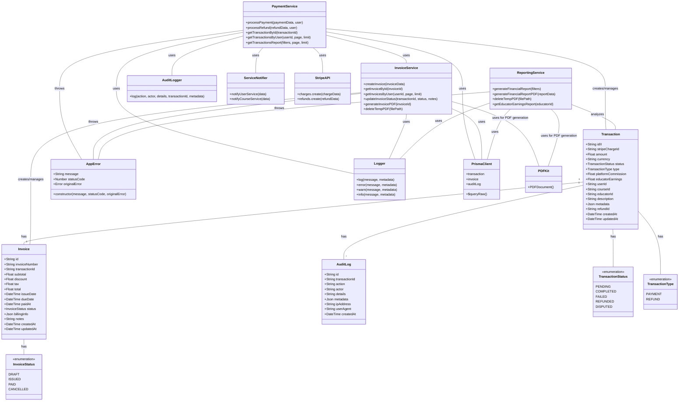

# Payment Service Class Diagram

## Key Components

### Models
- **Transaction**: Represents payment or refund transactions
- **Invoice**: Represents invoices generated for transactions
- **AuditLog**: Records system activities for auditing purposes

### Enums
- **TransactionStatus**: Status values for transactions (PENDING, COMPLETED, etc.)
- **TransactionType**: Types of transactions (PAYMENT, REFUND)
- **InvoiceStatus**: Status values for invoices (DRAFT, ISSUED, etc.)

### Services
- **PaymentService**: Handles payment processing and refunds
- **InvoiceService**: Manages invoice creation and PDF generation
- **ReportingService**: Generates financial reports and analytics

### Utilities
- **AppError**: Custom error handling
- **Logger**: System logging
- **AuditLogger**: Audit trail logging
- **ServiceNotifier**: Communicates with other microservices

### External Services
- **StripeAPI**: Payment gateway integration
- **PrismaClient**: Database ORM
- **PDFKit**: PDF generation library
